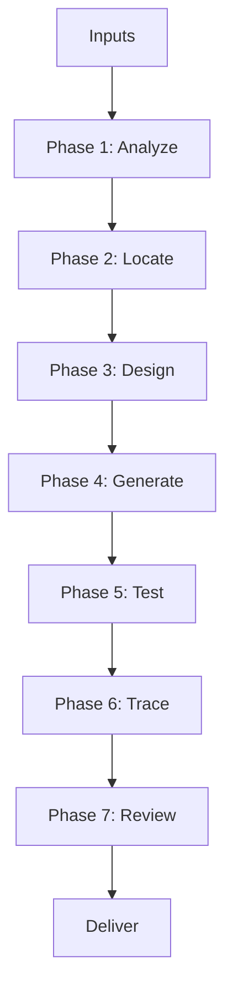

# End-to-End Workflow

## Purpose

Single runbook for agentic **feature delivery** — from requirement input through generated code, traceability, and review. Use for multi-capability work or when no narrower prompt applies.

For single-endpoint tasks, use [prompts/generate-new-api.md](prompts/generate-new-api.md) instead.

**Assumption:** Target Gradle module, dependencies, and domain model are **manually configured** in the SR repository. The agent generates and reviews code within that existing setup — it does not scaffold modules, package trees, or Gradle dependencies.

## Workflow Overview

## Required Inputs

| Input | Required | Source |
|-------|----------|--------|
| Feature description / user story | Yes | FRD, ticket, chat |
| Target module(s) | Yes | [module-map.md](module-map.md) + existing repo |
| Domain model | Recommended | ERD, architecture doc, or entities already in repo |
| OpenAPI draft | For API work | Existing spec or agent-created |
| Figma / screen flow | For UI-driven APIs | Design link |
| Integration details | When external systems involved | Integration spec |

If Critical inputs are missing, state assumptions and ask before Phase 4.

---

## Phase 1 — Analyze

**Goal:** Produce a Functional Analysis Summary before any code.

**Load:**

- [functional-analysis/functional-analysis-skill.md](functional-analysis/functional-analysis-skill.md)
- [functional-analysis/domain-model-analysis-skill.md](functional-analysis/domain-model-analysis-skill.md)
- [functional-analysis/workflow-analysis-skill.md](functional-analysis/workflow-analysis-skill.md) — if state transitions
- [functional-analysis/crud-flow-analysis-skill.md](functional-analysis/crud-flow-analysis-skill.md) — if CRUD screens
- [functional-analysis/event-flow-analysis-skill.md](functional-analysis/event-flow-analysis-skill.md) — if async
- [functional-analysis/integration-flow-analysis-skill.md](functional-analysis/integration-flow-analysis-skill.md) — if REST/gRPC/Kafka/Camel
- [functional-analysis/figma-analysis-skill.md](functional-analysis/figma-analysis-skill.md) — if design artifacts exist

**Output:** Capability list with IDs, business rules, error cases, backend artifact mapping.

---

## Phase 2 — Locate

**Goal:** Confirm Platform / Product / Solution placement and **existing** target module.

**Load:**

- [module-map.md](module-map.md)
- [core/platform-product-solution-boundary.md](core/platform-product-solution-boundary.md)
- [programming/product-layer-design-skill.md](programming/product-layer-design-skill.md)
- [programming/solution-layer-mapping-skill.md](programming/solution-layer-mapping-skill.md)
- [programming/service-runtime-switching-skill.md](programming/service-runtime-switching-skill.md) — if tenant-specific behavior

**Output:** Target module(s), layer decision per capability. Inspect the target repo for existing packages and conventions — do not define new module structure.

**Gate:** Run [checklists/pre-generation-checklist.md](checklists/pre-generation-checklist.md).

---

## Phase 3 — Design

**Goal:** OpenAPI contracts and integration design locked before implementation.

**Load:**

- [openapi/openapi-first-skill.md](openapi/openapi-first-skill.md)
- [openapi/api-path-standard-skill.md](openapi/api-path-standard-skill.md)
- [openapi/request-response-schema-skill.md](openapi/request-response-schema-skill.md)
- [openapi/pagination-filtering-sorting-skill.md](openapi/pagination-filtering-sorting-skill.md)
- [openapi/http-status-code-skill.md](openapi/http-status-code-skill.md)
- [programming/client-adapter-pattern-skill.md](programming/client-adapter-pattern-skill.md) — REST outbound
- [programming/grpc-client-adapter-skill.md](programming/grpc-client-adapter-skill.md) — gRPC outbound
- [programming/camel-route-skill.md](programming/camel-route-skill.md) — multi-step partner flows

**Output:** OpenAPI YAML (new or diff), adapter port list, event catalog.

---

## Phase 4 — Generate

**Goal:** Vertical slices per capability within the existing module.

**Load:**

- [programming/programming-skill.md](programming/programming-skill.md)
- [programming/industry-coding-standards-skill.md](programming/industry-coding-standards-skill.md)
- [programming/design-pattern-selection-skill.md](programming/design-pattern-selection-skill.md)
- [programming/spring-boot-layered-architecture-skill.md](programming/spring-boot-layered-architecture-skill.md)
- [code-generation/code-generation-output-standard.md](code-generation/code-generation-output-standard.md)
- Per-layer skills under [code-generation/](code-generation/)
- [templates/](templates/)

**Before coding each capability:**

1. Classify feature type (CRUD, integration, event, tenant variant, etc.)
2. Evaluate patterns by category — Creational → Structural → Behavioral — per [design-pattern-selection-skill.md](programming/design-pattern-selection-skill.md)
3. Confirm industry standards gate from [industry-coding-standards-skill.md](programming/industry-coding-standards-skill.md)

**Order per capability:**

1. Entity + repository + projection (list APIs) — or use existing entities
2. Request/response models + mapper
3. DTO validators + `XxxValidationService`
4. Service interface + impl — validate → map → save
5. Inbound adapter (controller)
6. Outbound adapter (WebClient / gRPC / Camel) if needed
7. Events + handlers if needed

**Sub-skill routing:**

| Need | Skill |
|------|-------|
| JPA / queries | [programming/spring-data-jpa-skill.md](programming/spring-data-jpa-skill.md) |
| List APIs | [programming/projection-skill.md](programming/projection-skill.md) |
| Validation | [programming/validation-skill.md](programming/validation-skill.md) |
| Service separation | [programming/service-layer-separation-skill.md](programming/service-layer-separation-skill.md) |
| Errors / codes | [programming/exception-handling-skill.md](programming/exception-handling-skill.md), [programming/message-code-convention-skill.md](programming/message-code-convention-skill.md) |
| Security | [programming/security-skill.md](programming/security-skill.md) |
| Observability | [programming/observability-skill.md](programming/observability-skill.md) |
| Reports | [programming/jasper-reporting-skill.md](programming/jasper-reporting-skill.md) |

---

## Phase 5 — Test

**Goal:** Unit + integration coverage for new behavior.

**Load:**

- [code-generation/test-generation-skill.md](code-generation/test-generation-skill.md)
- [code-generation/integration-test-generation-skill.md](code-generation/integration-test-generation-skill.md)

**Minimum:** Service unit tests + `@WebMvcTest` for each new endpoint; `@DataJpaTest` for non-trivial queries; integration test for critical end-to-end paths.

---

## Phase 6 — Trace

**Goal:** Link requirements, APIs, and code.

**Load:**

- [traceability/traceability-skill.md](traceability/traceability-skill.md)
- [traceability/api-traceability.md](traceability/api-traceability.md)
- [traceability/business-rule-traceability.md](traceability/business-rule-traceability.md)

**Output:** Traceability matrix:

| Req ID | Capability | API / Event | Class / Method |
|--------|------------|-------------|----------------|
| REM-001 | Create remittance | `POST /api/v1/remittances` | `RemittanceService.createRemittance` |

---

## Phase 7 — Review

**Goal:** Self-review before delivery.

**Load:**

- [review/review-skill.md](review/review-skill.md)
- [checklists/code-review-checklist.md](checklists/code-review-checklist.md)
- [checklists/api-review-checklist.md](checklists/api-review-checklist.md)
- [checklists/security-review-checklist.md](checklists/security-review-checklist.md)
- [checklists/observability-review-checklist.md](checklists/observability-review-checklist.md)
- [checklists/final-output-checklist.md](checklists/final-output-checklist.md)

Fix Critical and Major findings before deliver.

---

## Deliverables Package

Hand off one consolidated response containing:

1. **Summary** — module, layer, assumptions
2. **Functional Analysis Summary** (brief)
3. **OpenAPI** — paths or file list
4. **Generated files** — path list with one-line description each
5. **Traceability matrix**
6. **Review notes** — any remaining Minor items
7. **Test commands** — e.g. `./gradlew :sr-remittance-services:test`

---

## Prompt Mapping

| User intent | Start with |
|-------------|------------|
| Industry-standard code | [prompts/industry-standard-code-generation.md](prompts/industry-standard-code-generation.md) |
| Full feature | This workflow or [prompts/generate-new-feature.md](prompts/generate-new-feature.md) |
| Single API | [prompts/generate-new-api.md](prompts/generate-new-api.md) |
| Code in existing module | [prompts/generate-new-module.md](prompts/generate-new-module.md) — module/deps pre-configured |
| Update API | [prompts/update-existing-api.md](prompts/update-existing-api.md) |
| Refactor | [prompts/refactor-module.md](prompts/refactor-module.md) |
| Review only | [prompts/review-code.md](prompts/review-code.md) — Phases 6–7 only |
| Architecture fix | [prompts/fix-architecture-issue.md](prompts/fix-architecture-issue.md) |
| Business rule only | [prompts/add-business-rule.md](prompts/add-business-rule.md) — Phases 1–2, 4–6 |

---

## Related

- [agent-context.md](agent-context.md)
- [core/agent-behavior-rules.md](core/agent-behavior-rules.md)
- [SKILL.md](SKILL.md)
